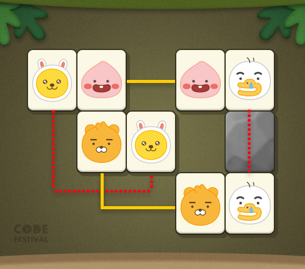

### 리틀 프렌즈 사천성

***

##### 문제 설명

```
언제나 맛있는 음식들이 가득한 평화로운 푸드 타운.
푸드 타운에서 행복하게 사는 리틀 프렌즈들은
마을에 있는 매직 스푼을 보물처럼 보관하고 있다.

매직 스푼은 재료만 준비해서 냄비에 넣고 휘젓기만 하면
순식간에 최고의 요리로 만들어주는 신비의 아이템.
어느 날 매직 스푼을 호시탐탐 노리는 악당들이 보물을 훔쳐간다.

매직 스푼을 되찾고 다시 마을에 평화를 가져오기 위해
프렌즈의 대모험이 시작되는데...
```

리틀 프렌즈 사천성은 프렌즈 사천성과 유사한 게임이다. 게임은 2차원 배열에서 진행되는데, 여러 가지 무늬로 구성된 타일이 배치되어 있으며 같은 모양의 타일은 두 개씩 배치되어 있다. 게임의 목적은 배치된 모든 타일을 제거하는 것으로, 같은 모양의 타일을 규칙에 따라 제거하면 된다. 타일을 제거할 수 있는 경우는 다음과 같다.              

다음 조건을 만족하는 경로가 있을 때 두 타일을 제거할 수 있다.                 

- 경로의 양 끝은 제거하려는 두 타일이다.
- 경로는 두 개 이하의 수평/수직 선분으로 구성되어 있고, 이들은 모두 연결되어 있다. (즉, 경로를 한 번 이하로 꺾을 수 있다)
  - 참고: 프렌즈 사천성은 경로가 세 개 이하의 선분으로 구성되어야 한다는 점이 다르다. (즉, 경로를 두 번 이하로 꺾을 수 있다)
- 경로 상에는 다른 타일 또는 장애물이 없어야 한다.

                

위의 배열에서 어피치 타일은 직선의 경로로 이을 수 있으므로 제거 가능하다. 라이언 타일 역시 한 번 꺾인 경로로 연결되므로 제거 가능하다. 무지 타일의 경우 다른 타일을 지나지 않는 경로는 두 번 꺾여야 하므로 제거할 수 없는 타일이며, 튜브 타일 역시 직선의 경로 사이에 장애물이 있으므로 제거 가능하지 않다.               

타일 배열이 주어졌을 때, 규칙에 따라 타일을 모두 제거할 수 있는지, 그 경우 어떤 순서로 타일을 제거하면 되는지 구하는 프로그램을 작성해보자.              

##### 입력 형식

입력은 게임판의 크기를 나타내는 m과 n, 그리고 배치된 타일의 정보를 담은 문자열 배열 board로 주어진다. 이 배열의 크기는 m이며, 각각의 원소는 n글자의 문자열로 구성되어 있다. 입력되는 값의 제한조건은 다음과 같다.                

- 1 <= m, n <= 100
- board의 원소는 아래 나열된 문자로 구성된 문자열이다. 각 문자의 의미는 다음과 같다.
  - <button>.</button> : 빈칸을 나타낸다.
  - <button>*</button> : 막힌 칸을 나타낸다.
  - 알파벳 대문자(A-Z): 타일을 나타낸다. 이 문제에서, 같은 글자로 이루어진 타일은 한 테스트 케이스에 항상 두 개씩만 존재한다.
  - board에는 알파벳 대문자가 항상 존재한다. 즉, 타일이 없는 입력은 주어지지 않는다.

##### 출력 형식

해가 존재하는 경우 타일을 제거하는 순서대로 한 글자씩 이루어진 문자열을, 그렇지 않은 경우 IMPOSSIBLE을 리턴한다. 해가 여러 가지인 경우, 알파벳 순으로 가장 먼저인 문자열을 리턴한다.              

##### 예제 입출력

| m | n | board | answer |
| :-- | :-- | :-- | :-- |
| 6 | 3 | ["DBA", "C*A", "CDB"] | "ABCD" |
| 2 | 4 | ["NRYN", "ARYA"] | "RYAN" |
| 4 | 4 | [".ZI.", "M.**", "MZU.", ".IU."] | "MUZI" |
| 2 | 2 | ["AB", "BA"] | "IMPOSSIBLE" |

